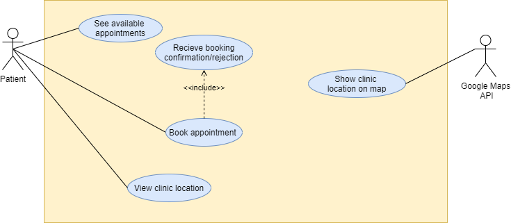
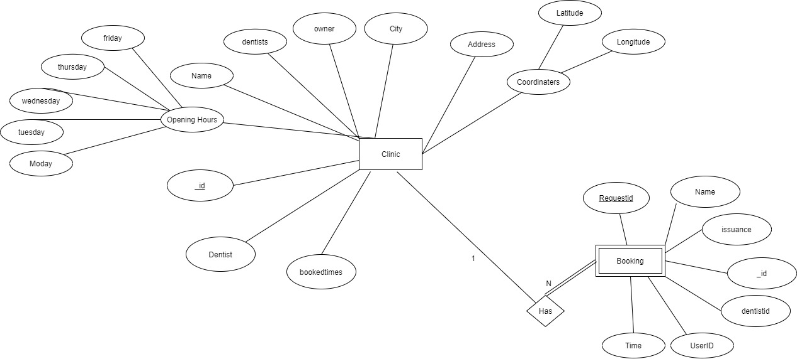
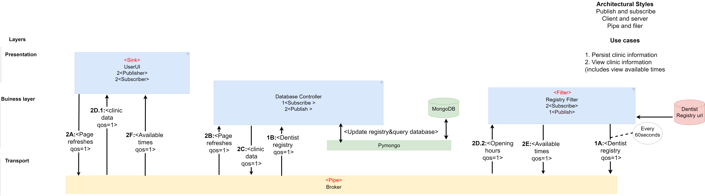
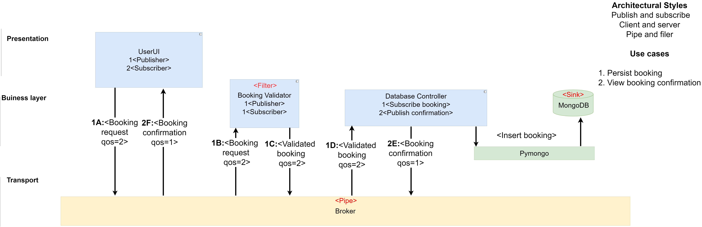
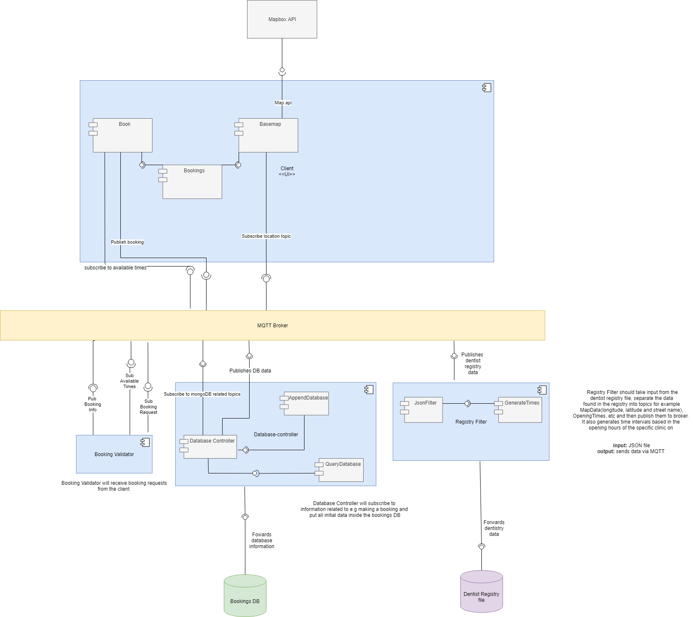
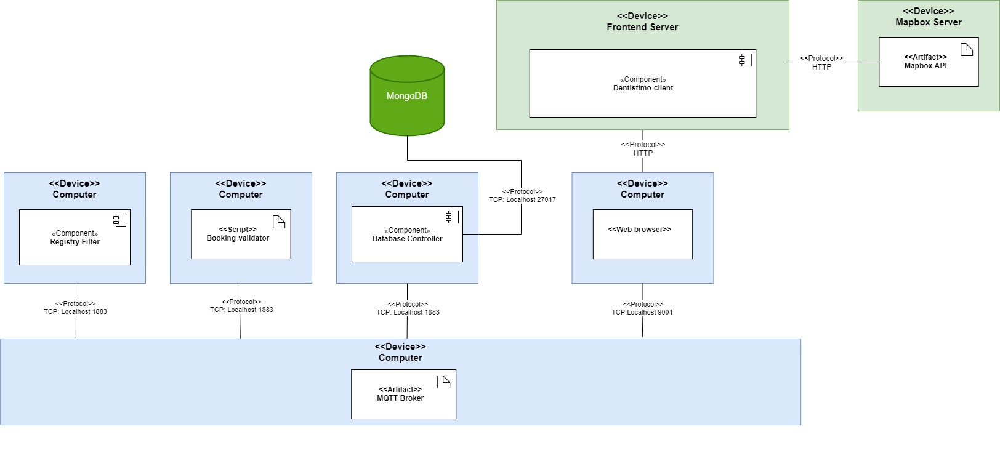
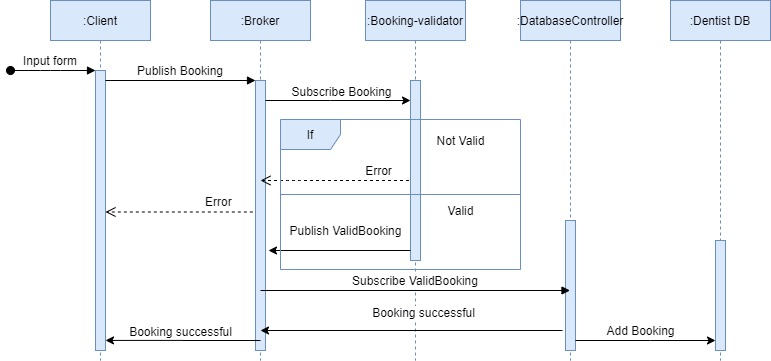
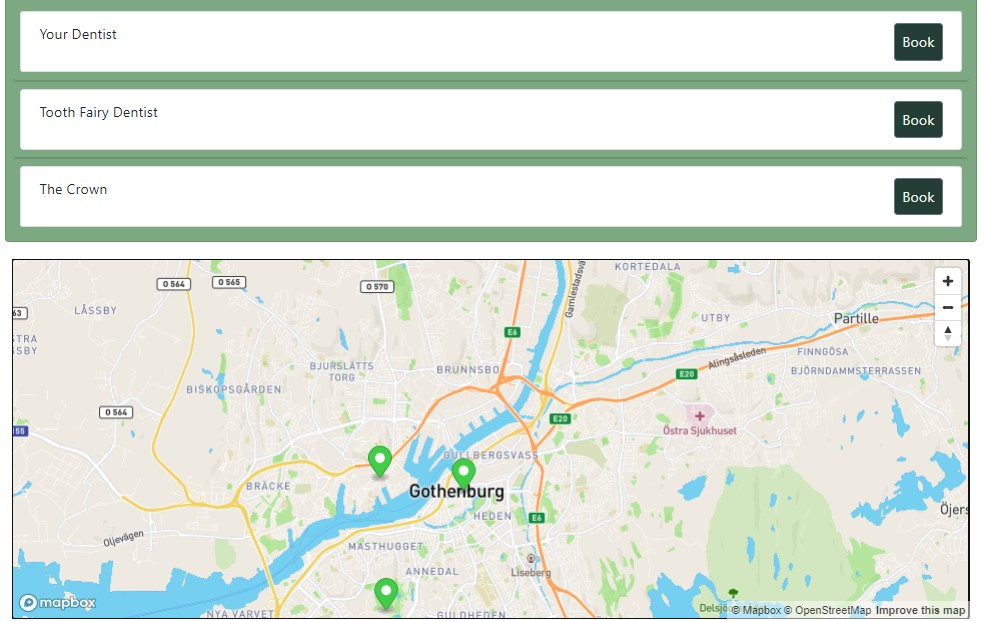
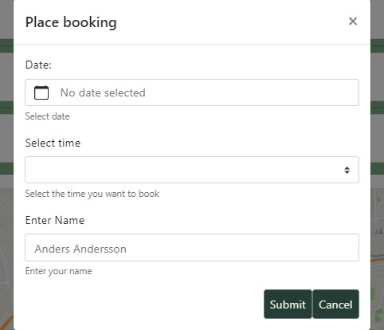

# Dentistimo Documentation

## Purpose
<ul>
 <li><Strong>Task:</strong> This application will provide ease of searching, booking and handling of dentist appointments.</li>
 <li><strong>Team members:</strong> @erichal, @davborje, @maxudd, @sijakob, @wennroth, @nihlmar </li>
</ul>

### Links to all relevant related team resources (Trello board, source-code repositories etc.)
<ul>
 <li><strong>Trello board:</strong> https://trello.com/b/RBnbEYLX/dit-355-2020-team-5-mean-girls</li>
 <li><strong>Googledrive:</strong> https://drive.google.com/drive/u/1/folders/1u0TOgqKEXNYdilTjOO4BHO5MYOqCdY-5</li>
</ul>

### Repositories
<ul>
 <li>https://git.chalmers.se/courses/dit355/2020/group-5/dentistimo-client</li>
 <li>https://git.chalmers.se/courses/dit355/2020/group-5/read-registry</li>
 <li>https://git.chalmers.se/courses/dit355/2020/group-5/booking-handler</li>
 <li>https://git.chalmers.se/courses/dit355/2020/group-5/dentistimo-documentation</li>
 <li>https://git.chalmers.se/courses/dit355/2020/group-5/request-generator</li>
</ul>

## Software Requirement Specification (SRS)
 <ul>

### Stakeholders

 <li>Patients (person's looking for a dentist)</li>
 <li>Dentists</li>
 <li>Folktandvården</li>
 <li>Västra Götalandsregionen (Västra Götaland Regional Council)</li>
 <li>Google Maps API</li>

### User stories
 <li>2. As a user I want to be able to see where the dentist is located on a map view so that I know where to go. </li>
 <li>3. As a user I would like to be able to see available times at the different clinics so I can choose a time that fits me. </li>
 <li>7. As a user I want to receive a confirmation notification so that I know that my booking was successful.</li>
 <li>10. As a dentist I would like a lunch break for 1h and another break for 30 min during these breaks I should not be able to book me for an appointment. </li>
 <li>12. As a user I want to be able to book an appointment so that i can go to the dentist.</li>
 <li>13. As a user I want to be able to book my dentist appointment via a webpage.</li>
 <li>14. As a clinic-owner I want to be able to change my opening hours.</li>
 <li>15. As a user, I don't want to be able to make a booking at a time that is already taken.</li>
 <li>16. As a developer I want to be able to generate booking requests so that I can stress test the system.</li>
 <li>17. As a developer I want the system to be able to handle errors.</li>
 <li>18. As a Clinic owner I want the system to be able to handle several dentists.</li>
 <li>19. As a developer I want to be able to stress test the system with a request generator.</li>
 <li>20. as a developer I wan to have a fault tolerant mechanism that can handle overload.</li>
 <li>21. As a user I want a  color coded queue for availability of clinics.</li>
</ul>

## Software Architecture Document (SAD)

### Decisions about software architecture 

The architectural styles used for the system are Pipe and Filter, Publish Subscribe and Client Server. Publish Subscribe is the style most frequently used due to its ability of subscribing/publishing to certain topics. By subscribing to a certain topic, we only receive the data of interest. Along with this, pub/sub provides easy scalability and a more dynamic topology. 

Pipe and Filter is used when sorting/filtering data and is important to be able to publish and subscribe to correct data. For example, it is being used to make sure published bookings are valid as well as providing correct booking availability to the user. 

Client Server is used for the frontend, the UserUI runs on a web server. 

### Use Case Diagram

### Entity-relationship Diagram

### Component Diagrams

##### In these diagrams, Registry Filter corresponds to the read-registry repo, and Booking Validator to the BookingHandler repo.

In this diagram, the flow of information is not linear: use case 1 and 2 happen independently.

In this use case diagram, the flow of information is linear: use case 1 and 2 happen consecutively.

Low level diagram

### Deployment Diagram

### Sequence Diagram Booking

### Mockup
Booking view:

Schema: 
This is a window with fixed size that inside is scrollable
here the available times from the currently selected clinic is shown ranked by date and time 
if “show all clinics” is selected then use should be shown available booking from all clinics ranked in the same way

Map:
Map should show all clinics or a specific one depending on what is selected from the clinic dropdown list in (a)

User input for booking:
This represents a pop-up screen that appears after the user has clicked Book

## Program Management Report (PMR)

### Weekly meetings
<ul>
<li>Wednesdays: Stand up meeting and Work meeting: 9-12</li>
<li>Thursdays: TA-meeting, Sprint retrospectives and Sprint planning followed by Work meeting: 8.30-12</li>
<li>Fridays: Stand up meeting and Work meeting: 13-15</li>
</ul>

### Roles
<ul>
<li> Product owner: TA and Teachers</li>
<li> Scrum master (Including agenda):</li>
<li> Scrum master Schema: Maja Wennroth, Maximilien Uddgren, Eric Hallberg, Jakob Sixten, David Börjesson, Carl Vågfelt Nihlmar</li>
</ul>
Responsibilities for the scrum master:
<ul>
<li>Make sure we come to a conclusion.</li>
<li>“Divide the word”.</li>
<li>If there is a problem without “ending” postpone it and take a note about it.</li>
<li>Create and post the agenda, What to do till the next meeting and what to do during the next meeting.</li>
<li>Make sure everybody is included and are allowed to state their opinion. </li>
</ul>

### Responsibilities apart from the Scrum Master:
<ul>
<li>Secretary: Maja Wennroth</li>
<li>Communication responsible: (including Discord and TA-communication): David Börjesson</li>
<li>Handin responsible: Maximilien Uddgren</li>
<li>Trello responsible: Jakob Sixten</li>
</ul>

### Meeting structure:

Stand up meeting:
<ul>
<li>What have I done since the last meeting,</li>
<li>What went well, </li>
<li>What issues did I face,</li> 
<li>What will I work with going forward,</li> 
<li>What potential issues may I have.</li>
</ul>
Summarize meeting:
<ul>
<li>What was good about the meeting</li>
<li>What can be improved to the next meeting</li>
<li>What should we have done/know for the next meeting to be productive?</li>
</ul>

### Commit structure:
<ul>
<li>Branch naming: relevant to the feature.</li>
<li>Create a branch via the issue related.</li>
</ul>

### Commit message:
<ul>
<li>3 Implement a post functionality</li>
<li>issue# What does the commit do</li>
</ul>

### How to make decisions:
<ul>
<li>Voting: </li>
<li>If 3-3, reason on why and vote again. </li>
<li>Scrum master make sure everyone votes and states their case. </li>
</ul>

### How to communicate:
<ul>
<li>If you’re late, communicate that to the group before the meeting starts. </li>
<li>Be in the meeting 5 minutes before starting time so the meeting can start at 8.</li>
<li>If you miss part of the meeting, it's your responsibility to ask for an update.</li>
<li>If you can't attend a meeting you should tell as soon as you know. </li>
<li>If you are a scrum master and cant attend you need to inform the group at least 1 days before.</li>
</ul>

### Important decisions made during meetings:
2020-12-18
<ul>
<li>increase communication within the team over christmas, make sure to inform everyone when a task is done etc.</li>
<li>Remove SSN as a userID and replace it with UUID.</li>
</ul>
2020-12-17
<ul>
<li>Add short explanatory comments to the code you have written for better understanding.</li>
</ul>
2020-12-9
<ul>
<li>Remove the initial home and view-booking page due to these not being a requirement. When required functionality is in place and if we have time left, we can continue following our initial mockup.</li>
</ul>
2020-12-3
<ul>
<li>Remove the dropdown list and replace it with another option</li>
<li>Navbar should be visible in all views to create easy routing</li>
<li>Remove phone number and email field form booking form as of now since its not</li>
</ul>
2020-12-2
<ul>
<li>Move wednesday TA meeting to Thursdays 8.30</li>
</ul>
2020-11-24
<ul>
<li>Pairprogramming, set pair for the week</li>
<li>If we realize a task in the trello cards is too big, break it down in smaller trello cards during work</li>
<li>Implement Bootstrap to the frontend</li>
</ul>
2020-11-20
<ul>
<li>When commiting to git, copy and paste the merged URL to the related trello card.</li>
</ul>
2020-11-19
<ul>
<li>Dentist is an attribute of the clinic (entity entity relationship diagram)</li>
<li>If a discussion paper without “ending” or is out of scope as of now. Put it in the parking-lot and bring it up again when it is relavent to the development process</li>
</ul>